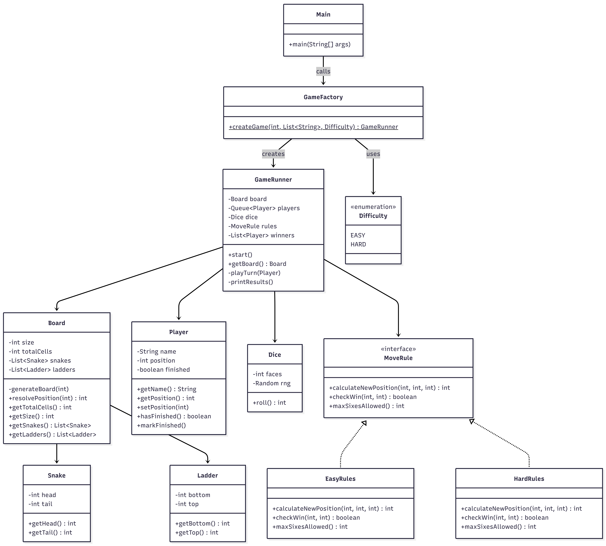

# Snake and Ladder Game

A command-line Snake and Ladder game built in Java with configurable board size, player count, and difficulty levels.

## How to Run

```bash
cd "Snake and Ladders Design/src"
javac com/snakeladder/*.java
java com.snakeladder.Main
```

## Features

- Configurable board size (n x n)
- Any number of players
- Two difficulty modes (Easy / Hard)
- Random snake and ladder placement with cycle prevention
- Turn-based gameplay with proper ranking of all players

## Design

### Classes

| Class | Responsibility |
|-------|---------------|
| `Main` | Entry point, takes user input (board size, players, difficulty) |
| `Board` | Holds the grid, generates snakes and ladders randomly, resolves landing effects |
| `Snake` | Represents a snake with head and tail positions |
| `Ladder` | Represents a ladder with bottom and top positions |
| `Player` | Tracks player name, position, and finished status |
| `Dice` | Simulates a random dice roll (1 to 6) |
| `MoveRule` | Strategy interface for movement, win check, and six-handling |
| `EasyRules` | Reaching or crossing last cell wins, unlimited re-rolls on 6 |
| `HardRules` | Must land exactly on last cell, max 3 consecutive sixes allowed |
| `GameFactory` | Assembles board, players, dice, and rules into a GameRunner |
| `GameRunner` | Runs the game loop, manages turns, tracks winners |
| `Difficulty` | Enum with EASY and HARD values |

### Design Patterns Used

- **Strategy Pattern**: `MoveRule` interface with `EasyRules` and `HardRules` implementations. This allows switching difficulty behavior without changing the game loop.
- **Factory Pattern**: `GameFactory.createGame()` assembles all game components based on user input.

### Class Diagram



### Game Flow

1. User enters board size (n), number of players, difficulty, and player names
2. `GameFactory` creates the board with n random snakes and n random ladders, initializes players and rules
3. `GameRunner.start()` begins the game loop
4. Each turn: player rolls dice -> position is calculated based on rules -> snake/ladder effects applied
5. Rolling a 6 grants an extra turn (Easy: unlimited, Hard: max 3 consecutive)
6. In Easy mode, reaching or crossing the last cell wins. In Hard mode, you must land exactly on it
7. Game continues until only 1 player remains. All players are ranked

### Rules by Difficulty

| Rule | Easy | Hard |
|------|------|------|
| Win condition | Reach or cross last cell | Land exactly on last cell |
| Overshoot | Caps at last cell (wins) | Stay at current position |
| Rolling a 6 | Unlimited extra turns | Max 3 consecutive sixes, then turn ends |
