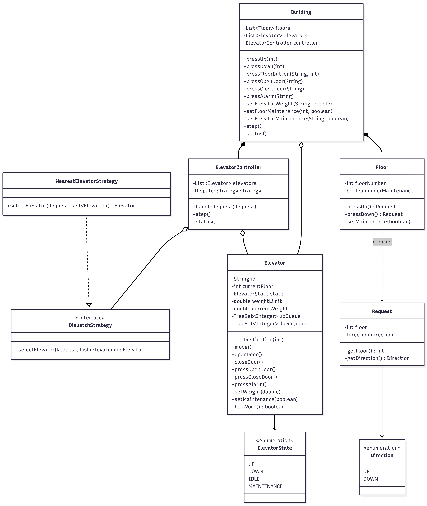

# Elevator System Design

Built an elevator system in Java that handles multiple carts, outside/inside button controls, weight limits, alarms, and maintenance modes.

## How to Run

```bash
cd elevator/src
javac com/elevator/*.java
java com.elevator.Main
```

## What it does

- Multiple elevators each with their own weight limit
- Outside buttons (up/down) on every floor, dispatches the closest available elevator
- Inside buttons let passengers select their destination floor
- Alarm button stops the elevator immediately and opens doors
- If weight goes over the limit, elevator stops and doors open until weight is reduced
- Floors and elevators can be put under maintenance separately

## Classes

| Class | What it does |
|-------|-------------|
| `Building` | Ties everything together, this is what the user interacts with |
| `Floor` | Each floor has up/down buttons and a maintenance flag |
| `Elevator` | Individual cart with its own state, weight tracking, and two request queues (one for going up, one for going down) |
| `ElevatorController` | Takes requests from floors and decides which elevator should handle it |
| `DispatchStrategy` | Interface so we can swap out how elevators are picked |
| `NearestElevatorStrategy` | Picks the closest elevator thats idle or already heading in the right direction |
| `Request` | Simple object holding the floor number and which direction was pressed |
| `ElevatorState` | Enum for the four states: UP, DOWN, IDLE, MAINTENANCE |
| `Direction` | Enum: UP, DOWN |

## Design Patterns

**Strategy Pattern** for dispatch - the controller doesnt care how an elevator is selected, it just asks the strategy. Right now we have `NearestElevatorStrategy` but you could plug in round-robin or least-loaded without touching the controller.

## How it works

1. Someone presses UP on floor 3
2. `Floor` creates a `Request(floor=3, direction=UP)`
3. `ElevatorController` passes this to the `DispatchStrategy`
4. Strategy looks at all elevators, skips ones in maintenance, and picks the best one (prefers idle elevators or ones already going up that are below floor 3)
5. Selected elevator adds floor 3 to its `upQueue`
6. On the next `step()`, elevator moves to floor 3, opens door, closes door

Inside buttons work differently - they go directly to that specific elevator's queue since passengers are already inside.

## Elevator Queue Logic

Each elevator has two `TreeSet` queues:
- `upQueue` sorted ascending (serves lowest floor first while going up)
- `downQueue` sorted descending (serves highest floor first while going down)

When all up requests are done, it switches direction. This is basically the SCAN algorithm that real elevators use.

## Special Scenarios

| Scenario | What happens |
|----------|-------------|
| Overweight | Elevator stops, door opens, wont move until weight is reduced |
| Alarm pressed | Elevator stops immediately, all queued requests cleared, door opens |
| Floor under maintenance | Up/down buttons on that floor dont work, returns nothing |
| Elevator under maintenance | Taken out of service, all requests cleared, dispatch ignores it |

## Class Diagram


