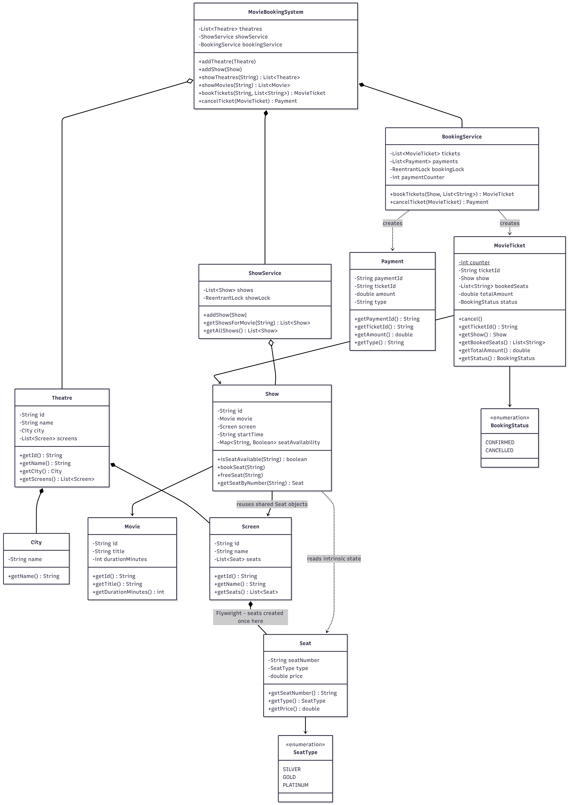

# Movie Ticket Booking System

A movie ticket booking system in Java that handles theatres, shows, seat booking with concurrency control, and cancellation with refunds.

## How to Run

```bash
cd movieBooking/src
javac com/moviebooking/*.java
java com.moviebooking.Main
```

## APIs

| Method | What it does |
|--------|-------------|
| `bookTickets(showId, seats)` | Books given seats for a show, returns a MovieTicket |
| `showTheatres(cityName)` | Returns all theatres in a city |
| `showMovies(cityName)` | Returns all movies playing in theatres in that city |
| `cancelTicket(ticket)` | Cancels booking, frees seats, processes refund |

## Classes

| Class | What it does |
|-------|-------------|
| `MovieBookingSystem` | Main facade, ties everything together, exposes all APIs |
| `BookingService` | Handles booking and cancellation with thread safety using ReentrantLock |
| `ShowService` | Manages shows, thread-safe addition by admins using ReentrantLock |
| `Theatre` | Has an id, name, city, and list of screens |
| `Screen` | Has an id, name, and list of seats |
| `Show` | Links a movie to a screen at a time, tracks seat availability |
| `Movie` | Has id, title, duration |
| `Seat` | Has seat number, type (SILVER/GOLD/PLATINUM), and price |
| `MovieTicket` | Generated on booking, holds show, seats, amount, and status |
| `Payment` | Tracks charges and refunds against tickets |
| `City` | Simple wrapper for city name |
| `SeatType` | Enum: SILVER, GOLD, PLATINUM |
| `BookingStatus` | Enum: CONFIRMED, CANCELLED |

## How Concurrency is Handled

Two places need thread safety:

1. **Booking seats** - Two users trying to book the same seat at the same time. `BookingService` uses a `ReentrantLock`. When a booking comes in, it locks, checks all seats are available, marks them booked, creates the ticket, then unlocks. Second thread finds the seat taken and booking fails.

2. **Adding shows by admins** - Multiple admins adding shows simultaneously. `ShowService` uses its own `ReentrantLock` so show additions dont corrupt the list.

## How Cancellation Works

1. Check if ticket is already cancelled
2. Free all booked seats back in the show's availability map
3. Mark ticket status as CANCELLED
4. Create a REFUND payment for the full amount
5. All of this happens inside the lock so no race conditions

## How Booking Works

1. User calls `bookTickets("SH1", ["A1", "B1"])`
2. `MovieBookingSystem` finds the show by id
3. Passes to `BookingService` which locks
4. Checks every requested seat is available
5. If any seat is taken, entire booking fails (no partial booking)
6. Marks seats as booked, calculates total from seat prices
7. Creates `MovieTicket` and `Payment`, unlocks

## Class Diagram


