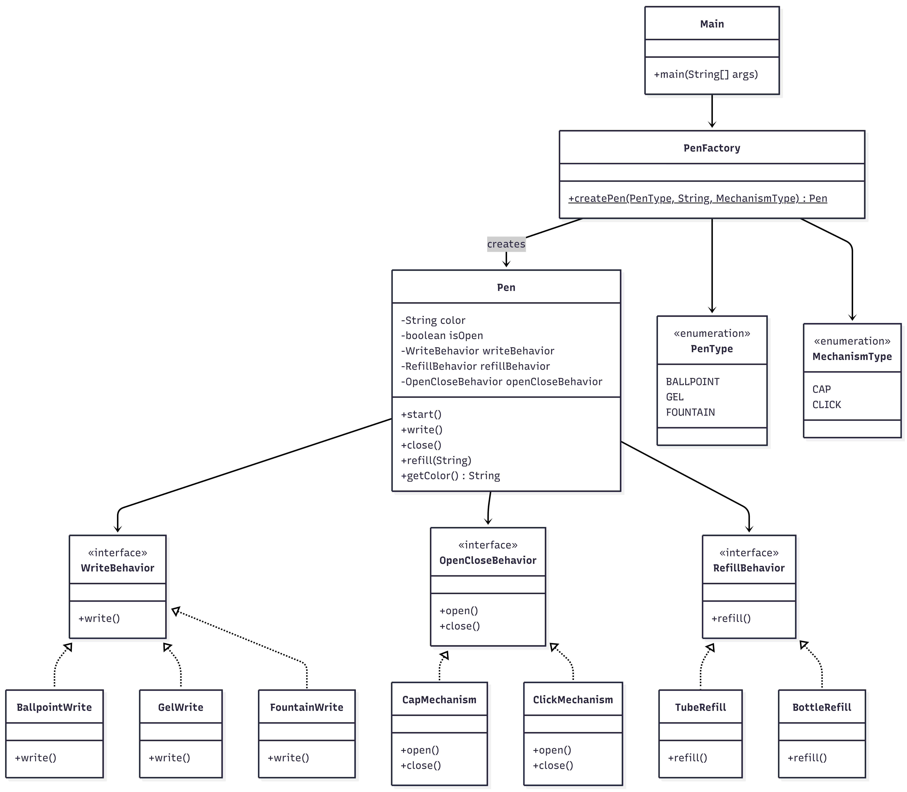

# Pen Design

A pen simulation built in Java demonstrating the Strategy and Factory design patterns.

## How to Run

```bash
cd pen/src
javac com/pen/*.java
java com.pen.Main
```

## Requirements

- Pen has behaviors: write(), refill(), start(), close()
- Must call start() before writing and close() after
- Each pen has one color at a time
- Pen is refillable (not use-and-throw)
- Pen can be cap-based or click-based
- Color can be changed by refilling with a different color

## Design

### Classes

| Class | Responsibility |
|-------|---------------|
| `Pen` | Core class with color, open/close state, and delegated behaviors |
| `WriteBehavior` | Strategy interface for writing style |
| `BallpointWrite` | Ballpoint writing implementation |
| `GelWrite` | Gel ink writing implementation |
| `FountainWrite` | Fountain nib writing implementation |
| `OpenCloseBehavior` | Strategy interface for open/close mechanism |
| `CapMechanism` | Cap-based open/close |
| `ClickMechanism` | Click-based open/close |
| `RefillBehavior` | Strategy interface for refilling |
| `TubeRefill` | Tube replacement refill (ballpoint, gel) |
| `BottleRefill` | Bottle ink refill (fountain) |
| `PenFactory` | Creates pens by wiring correct strategies based on pen type and mechanism |
| `PenType` | Enum: BALLPOINT, GEL, FOUNTAIN |
| `MechanismType` | Enum: CAP, CLICK |

### Design Patterns

- **Strategy Pattern**: Three behaviors (write, open/close, refill) are defined as interfaces with multiple implementations. The `Pen` class delegates to these strategies instead of having hardcoded behavior. This allows mixing any writing style with any mechanism.
- **Factory Pattern**: `PenFactory.createPen()` picks the right strategy implementations based on pen type and mechanism type.

### Pen Type Configuration

| Pen Type | Write Style | Refill Style |
|----------|------------|-------------|
| BALLPOINT | BallpointWrite | TubeRefill |
| GEL | GelWrite | TubeRefill |
| FOUNTAIN | FountainWrite | BottleRefill |

Any pen type can be combined with either CAP or CLICK mechanism.

### Class Diagram


